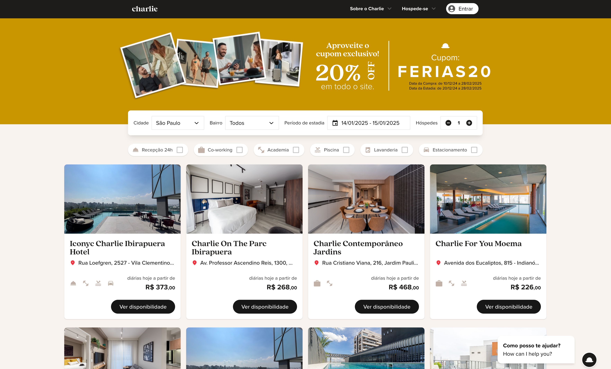

# Produto A

#### Sobre o produto

Lorem ipsum dolor sit amet, consectetur adipiscing elit. Vestibulum posuere leo lorem, in auctor lacus interdum nec. Sed quis accumsan odio, sed accumsan libero. Etiam condimentum euismod orci quis pharetra. Phasellus condimentum velit mi, quis placerat justo gravida in. Aenean ut elementum lacus, id interdum sem. Quisque vulputate porta lectus vitae vehicula. Cras augue velit, venenatis at condimentum in, tincidunt ac metus. Cras posuere nibh in purus bibendum, ac blandit nibh dapibus.&#x20;

<figure><figcaption><p>Captura de Tela</p></figcaption></figure>

&#x20;Aenean ut elementum lacus, id interdum sem. Quisque vulputate porta lectus vitae vehicula. Cras augue velit, venenatis at condimentum in, tincidunt ac metus. Cras posuere nibh in purus bibendum, ac blandit nibh dapibus.&#x20;

#### **Estrutura do Projeto**

```plaintext
plaintextCopy codesrc/
├── components/    # Componentes reutilizáveis
├── hooks/         # Hooks customizados
├── pages/         # Rotas do Next.js
├── styles/        # Estilos globais e TailwindCSS
├── utils/         # Funções utilitárias
└── tests/         # Arquivos de teste
```

**Padrões de Nomeação**

* **Arquivos e pastas**: kebab-case.
* **Componentes**: PascalCase (ex.: `Button.tsx`).
* **Hooks**: camelCase (ex.: `useFetch.ts`).
